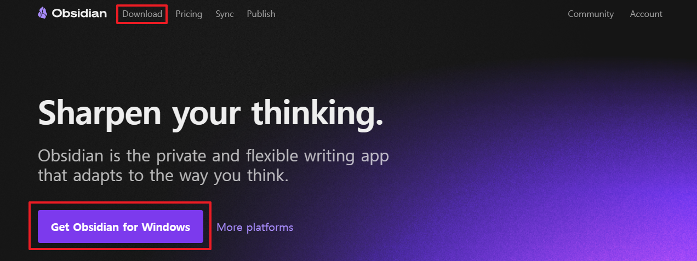

> [!INFO] 관련 참조 정보
> links:  
> MOC:  
> type: 
## Windows 설치
1. [옵시디언 홈 페이지](https://obsidian.md/)에 접속 후 Download 또는 Get Obsidian for Windows를 클릭해 페이지를 이동한다.
   
2. Download for Windows를 클릭해 설치 파일을 다운로드한다.
   
3. 설치 파일을 실행하고 별다른 설정없이 진행하면 된다.
## 참고 문헌
- [@DownloadinstallObsidianObsidianHelpa](../90.%20Resources/93.%20References/@DownloadinstallObsidianObsidianHelpa.md)