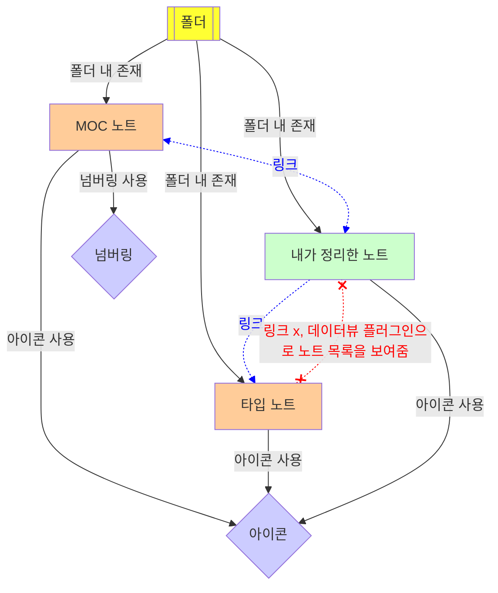
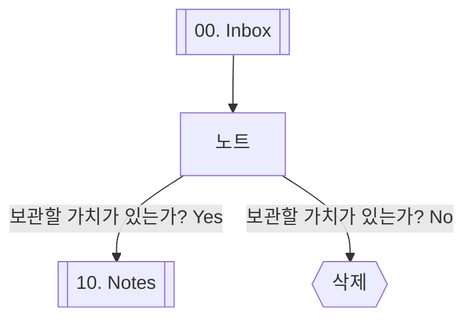

> [!INFO] **관련 참조 정보**
> links: [🏛️ 000 홈](🏛️%20000%20홈.md) | [🏛️ 000.01 가이드라인](🏛️%20000.01%20가이드라인.md)  
## 분류 가이드
노트를 분류하는 것은 정보를 효과적으로 관리하고, 필요한 정보를 찾는 데 도움이 된다. 주요 내용, 목적에 따라 다양한 방법으로 분류할 수 있다.
- MECE(Mutually Exclusive and Collectively Exhaustive)하게 분류하기
	- 각 카테고리는 겹치지 않고, 모든 항목은 적어도 하나의 카테고리에 속해야 한다.
- 인지 가능한 범위에서 분류하기
	- 너무 많은 서브카테고리를 만들어 인지 가능한 범위를 초과하지 않아야 한다.
- 일관된 기준으로 분류하기
	- 즉흥적인 분류보다 항상 일관된 기준에 맞는지 검토 후 분류한다.
- 분류 후 관리하기
	- 분류가 된 상태라도 주기적으로 검토하고 필요에 따라 수정하거나 갱신 해야 한다.
	- 분류 체계는 항상 동적이어야 하며, 더 나은 분류 방법이 생긴다면 적극 수용한다.
### 분류 종류 및 플로차트
- 폴더
- MOC(Map of Contents) 노트
	- 넘버링
- 타입 노트
- 아이콘

## 타입 가이드
각 노트의 유형에 따라 분류하는데 사용되며, 노트 작성 시 적절한 타입 노트를 링크(백링크)한다. 타입 노트는 링크된 모든 노트를 모아서 볼 수 있게 하는 역할을 한다.
- [[🏷 가이드라인]]
	- 다양한 사용법을 정리한 노트
	- 특정 주제나 도구 등에 대한 사용 가이드라인을 제공하여 이해를 돕고, 효과적인 사용법을 안내한다.
- [[🏷 개념 노트]]
	- 특정 개념이나 이론을 중점으로 기록한 노트
	- 개념의 정의, 특징, 관련 이론 등을 포함하여 깊은 이해를 돕는다.
- [[🏷 실습 노트]]
	- 이론적으로 배운 내용을 실제로 적용하고, 그 과정을 정리한 노트
	- 프로젝트보다는 규모가 작으며 연습, 실험 등을 실제로 활용해보는 것을 목적으로 진행한 과정을 담는다.
- [[🏷 프로젝트 노트]]
	- 특정 프로젝트에 대한 계획, 진행 상황, 결과 등을 상세하게 기록하고 관리하는 노트
	- 단순 실습보다는 규모가 크며, 프로젝트의 목표 설정, 일정 관리, 업무 분배, 문제 해결 과정, 최종 결과 및 회고 등 프로젝트의 전반적인 내용을 담는다.
- [[🏷 데일리 노트]]
	- 할 일, 회고, 생각 정리 등을 기록하는 노트
	- 일일 활동을 추적하고, 성장과 발전을 위한 계획과 반성 등을 기록한다.
## 폴더 가이드
노트나 파일의 상태와 용도를 기준으로 분류하는데 사용된다.
- 00\. Inbox
	- 새로 생성된 노트, 분류되지 않은 노트, 나중에 처리할 노트, 임시로 작성한 노트 등을 보관하는 폴더
	- 일정 기간을 두고 사용하지 않는 노트는 폐기하고, 완성도가 높아진 노트는 10\. Notes 폴더로 옮긴다.
- 10\. Notes
	- 완성도가 높은 노트를 보관하는 폴더
	- 주기적으로 검토하고 수정 및 갱신을 통해 노트의 정보가 최신 정보를 반영할 수 있게 노력해야 한다.
- 90\. Resource
	- 특정 목적을 위해 형식을 갖춘 노트, 첨부 파일 등 노트 작성 시 필요한 여러 노트 및 자료를 보관하기 위한 폴더
### 폴더 플로차트

## MOC 가이드
Map of Contents의 약자로, 특정 주제나 분야에 대한 노트들을 연결하고 구조화하는 역할을 한다. 이는 깊은 이해를 돕고, 노트들을 한 눈에 파악할 수 있게 한다.
### 일반적인 MOC 구성 방법
1단계와 2단계 MOC는 추상적이고, 3단계부터 상세 주제를 정해 4단계, 5단계까지 구체화한다.
- 1단계 MOC 노트
	- 최상위 주제를 정하고, 이에 대한 2레벨 MOC 노트를 링크와 임베드한다.
- 2단계 MOC 노트
	- 3단계 MOC인 상세 주제를 포괄적으로 담을 수 있는 주제로 정하고, 이 노트에 3, 4, 5단계 MOC를 나열하고 정리한 노트를 링크한다.
	- 리스트 형태로 들여 써서 레벨을 한눈에 파악할 수 있게 작성한다.
- 3단계~5단계 MOC
	- 상세 주제가 정해지는 MOC로, 총 3단계(3, 4, 5)의 상하 구조를 가질 수 있다.
	- 이 단계는 노트가 생성되지 않으며, 텍스트로만 작성된 형태다.
### 옵시디언을 활용한 PKM 시스템과 관련된 특별한 MOC 노트
[홈](🏛️%20000%20홈.md), [가이드라인](🏛️%20000.01%20가이드라인.md)과 같은 노트들은 일반적인 MOC와 다른 방식으로 작성 및 관리되며, 이 노트들은 PKM 시스템에서 특별한 역할을 한다. 추후 다른 노트가 추가될 수 있다.
- [홈](🏛️%20000%20홈.md)노트는 1~5단계의 TOC의 원리로 상하 계층 구조를 표현한다.
- [가이드라인](🏛️%20000.01%20가이드라인.md)노트는 옵시디언을 활용하기 위한 나만의 규칙을 정리한다.
## 넘버링 가이드
일련번호를 부여해 순서를 분류하는데 사용된다. 물리적으로 순서를 유지할 수 있고, 순서는 논리 체계가 반영된 상태라고 볼 수 있다.
### 폴더 넘버링
- 10, 20, 30, ..., 90
### MOC 넘버링
- 1단계 MOC
	- 010, 020, 030, ...
- 2단계 MOC
	- 011, 012, 013, ...
- 3단계 MOC
	- 011.01, 011.02, 011.03, ...
- 4단계 MOC
	- 011.01-A, 011.01-B, 011.01-C, ...
- 5단계 MOC
	- 011.01-A1, 011.01-A2, 011.01-A3, ...
## 아이콘 가이드
특정 카테고리나 구분 등을 직관적으로 나타내기 위해 사용한다.
### MOC 아이콘
- 🏛 - 홈, 가이드라인 (TTT@)
- 📖 - 1단계 MOC (T@)
- 📚 - 2단계 MOC (TT@)
### MOC 외 아이콘
- 🏷 - 타입 (E@)
- 📅 - 데일리 노트 (EEE@)
- 🖨️ - 템플릿 (EEEE@)
- 🔖 - 결과물 (R@)
- 📜 - 타인의 결과물 (RR@)
## 태그 가이드
정보를 분류, 검색, 필터링하는데 유용한 키워드로 정의한다. 다른 영역에서 분류 체계를 잘 구성했기 때문에 자유롭게 사용하면 된다.  
## 프론트매터 가이드
문서의 메타데이터를 정의할 때 사용한다. 이 정보는 노트를 분류하거나 검색할 때 유용하다.
```
---
title: <% tp.file.title %>
aliases: 
tags: 
category: 
created date: 
modified date: 
status:
---
```
- title
	- 노트의 제목을 나타내며 일반적으로 파일명과 동일하다.
- aliases
	- 노트의 별칭을 의미하고, 링크 시 링크 텍스트로 활용할 수 있다.
- tags
	- 노트의 주제와 관련된 태그로, 노트 제목과 카테고리와 중첩되지 않아야한다.
- category
	- 노트의 카테고리를 나타낸다.
- created date
	- 노트의 생성일을 나타낸다.
- modified date
	- 노트의 수정일을 나타낸다.
- status
	- 노트의 완료 상태를 나타낸다. 
	- 나중에 수정 가능성이 있더라도, 현 시점을 기준으로 완료 여부를 판단한다.
